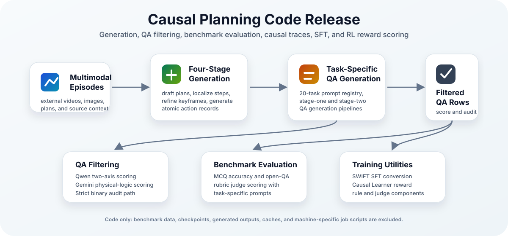
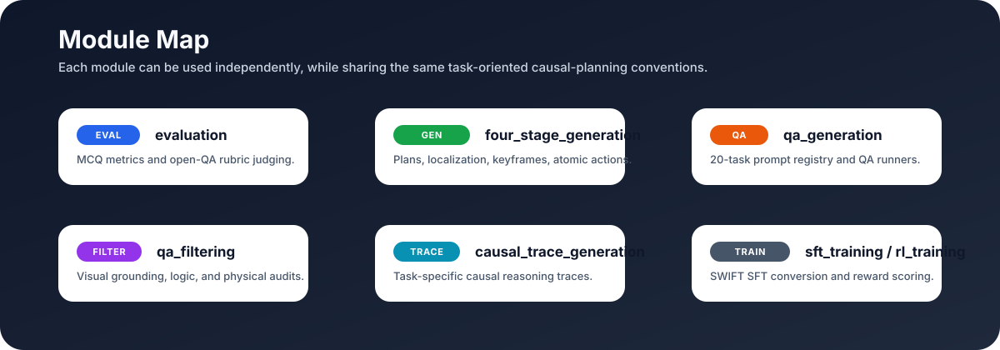

<div align="center">

# Causal Planning Code Release

**Code release for multimodal causal-planning evaluation, data generation, QA filtering, causal trace generation, SFT preparation, and RL reward scoring.**


[Overview](#overview) •
[Getting Started](#getting-started) •
[Evaluation](#evaluation) •
[Generation](#generation-and-filtering) •
[Training](#training-utilities) •
[Repository Layout](#repository-layout)



</div>

## Overview

This repository provides the source code for the main components of a multimodal causal-planning pipeline:

- Four-stage visual plan and atomic-action generation.
- Task-specific QA generation over causal-planning outputs.
- Post-generation QA filtering with visual-grounding, logical-coherence, and physical-logic checks.
- Benchmark evaluation for MCQ and open-QA tasks.
- Causal reasoning trace generation for QA rows.
- SWIFT-compatible SFT data preparation.
- Causal Learner reward code for RL training.

Benchmark data, training data, model checkpoints, generated outputs, runtime caches, and machine-specific job scripts are intentionally not stored in this repository.

<p align="center">
  
</p>

## Getting Started

Clone the repository and install dependencies only for the module you need. For benchmark evaluation:

```bash
git clone <REPOSITORY_URL>
cd <REPOSITORY_DIR>/evaluation
python -m pip install -r requirements.txt
```

Model-backed generation, filtering, and evaluation require the relevant Azure OpenAI or OpenAI-compatible endpoint credentials documented in each module README.

## External Data Layout

Evaluation expects an external benchmark data directory:

```text
benchmark_data/
  mcq/
  qa/
  multimodal_data/
```

Place this directory at `benchmark_data/` under the repository root, or set `BENCHMARK_DATA_ROOT` explicitly.

## Evaluation

Validate prompt definitions, data structure, media references, and dry-run evaluation logic:

```bash
cd evaluation
BENCHMARK_DATA_ROOT=<BENCHMARK_DATA_DIR> \
bash validate_benchmark_prompts_and_data.sh
```

Run the full benchmark evaluation:

```bash
cd evaluation
BENCHMARK_DATA_ROOT=<BENCHMARK_DATA_DIR> \
bash run_full_benchmark_evaluation.sh
```

The validation script compiles the evaluation code, checks task-specific open-QA judge prompts, verifies MCQ and open-QA rows, checks media availability, and runs dry-run evaluation without model API calls. The full evaluation script runs MCQ evaluation and open-QA generation plus rubric judging. Model aliases and provider settings are defined in `evaluation/open_qa_model_registry.json`.

## Generation And Filtering

Four-stage generation entry points:

```bash
python four_stage_generation/single_step/generate_single_step_four_stage_dataset.py --help
python four_stage_generation/multi_step/run_multi_step_four_stage_pipeline.py --help
```

QA generation entry points:

```bash
python qa_generation/qa_generators/stage_one_qa_generator/generate_stage_one_qa_parallel.py --help
INPUT_ROOT=<FINAL_PLAN_ITEM_DIR> OUTPUT_DIR=<QA_OUTPUT_DIR> \
bash qa_generation/qa_generators/stage_two_qa_generator/run_stage_two_qa_generation.sh
```

QA filtering entry points:

```bash
python qa_filtering/score_existing_qa_qwen_two_axis.py --help
python qa_filtering/score_existing_qa_gemini_physical_logic.py --help
python qa_filtering/filter_existing_qa_physical_logic_audit.py --help
```

The Qwen filter evaluates accurate visual grounding and general logical coherence in one pass. The Gemini physical-logic filter evaluates preconditions, causal dependencies, state transitions, timeline consistency, and physical feasibility.

## Causal Trace Generation

```bash
SOURCE_ROOT=<QA_INPUT_DIR> OUTPUT_ROOT=<QA_WITH_TRACES_DIR> \
bash causal_trace_generation/run_task_specific_causal_trace_generation.sh
```

Local trace-contract checks:

```bash
python causal_trace_generation/validate_causal_trace_contracts.py
```

## Training Utilities

Prepare SWIFT-compatible SFT data:

```bash
python sft_training/prepare_swift_sft_dataset.py \
  --input-jsonl <QA_JSONL> \
  --output-jsonl <SWIFT_SFT_JSONL>
```

Run SWIFT SFT through environment-variable configuration:

```bash
cd sft_training
SFT_MODEL=<MODEL_OR_CHECKPOINT> \
SFT_DATASET=<SWIFT_SFT_JSONL> \
bash run_swift_sft.sh
```

Use the RL reward package from Python:

```python
from causal_learner_reward import compute_score
```

See `rl_training/README.md` for the expected reward input schema and judge-backed scoring configuration.

## Repository Layout

| Directory | Purpose |
| --- | --- |
| `evaluation/` | MCQ and open-QA benchmark evaluation without bundled benchmark data. |
| `four_stage_generation/` | Single-step and multi-step plan, localization, keyframe, and atomic-action generation. |
| `qa_generation/` | Active 20-task QA prompt registry and QA generation runners. |
| `qa_filtering/` | Qwen two-axis QA scoring and Gemini physical-logic scoring/auditing. |
| `causal_trace_generation/` | Task-specific causal reasoning trace generation and validation. |
| `sft_training/` | SWIFT SFT data conversion and launch wrapper. |
| `rl_training/` | Causal Learner reward logic for RL training. |

## Data Policy

This repository intentionally excludes benchmark data, training data, model checkpoints, generated outputs, runtime caches, machine-specific job scripts, and environment-specific activation commands.

All prompt content required by the active generation, filtering, evaluation, SFT, and reward code is stored in Python or shell source files. Markdown files are kept only as README files.
