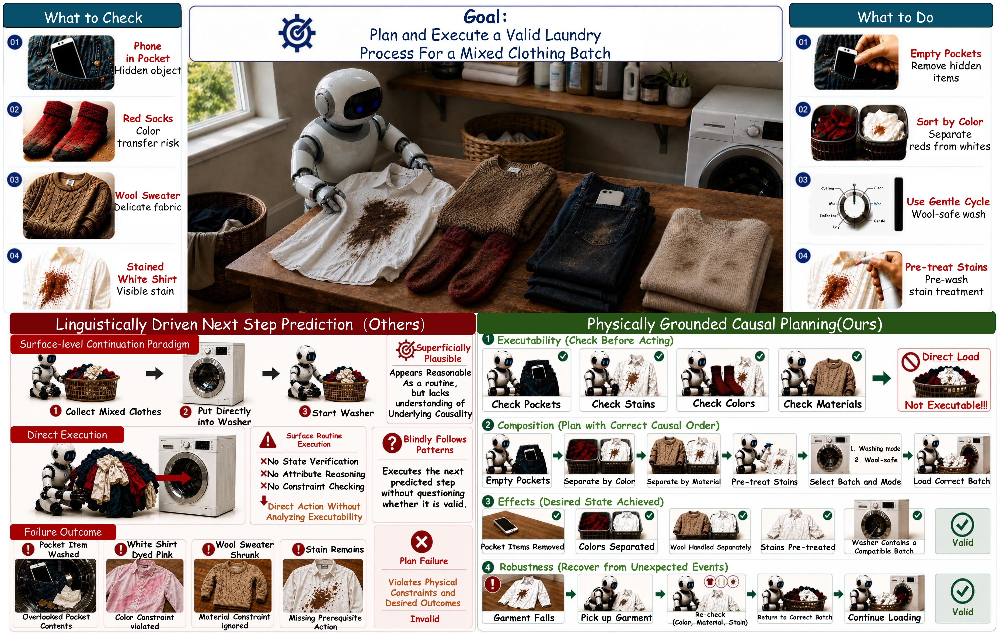
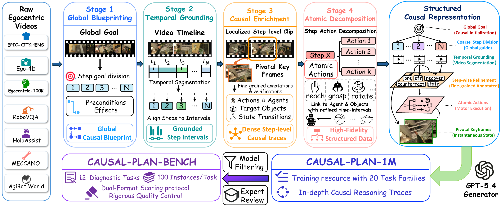
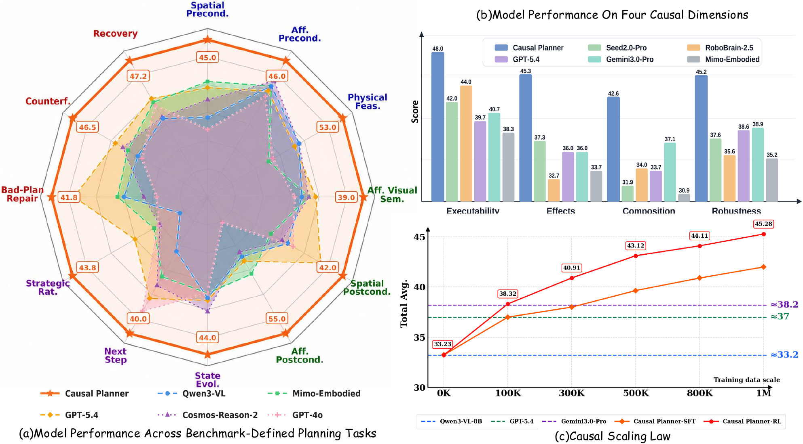
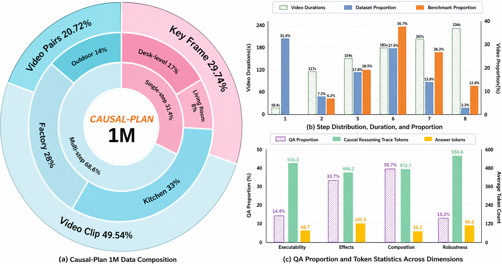

<div align="center">

# Token Predictors Are Not Planners

**Building Physically Grounded Causal Reasoners**


[Overview](#overview) •
[What Is Released](#what-is-released) •
[Evaluation](#evaluation) •
[Generation And Filtering](#generation-and-filtering) •
[Training Utilities](#training-utilities) •
[Repository Layout](#repository-layout)



</div>

## Overview

This repository is the code release for **Token Predictors Are Not Planners: Building Physically Grounded Causal Reasoners**. The project studies embodied planning as physically grounded causal reasoning rather than surface-level next-token continuation, focusing on the observation that plausible action sequences can still fail when they ignore hidden preconditions, object affordances, state transitions, temporal dependencies, or recovery constraints.

In the paper, Causal Plan denotes the framework and released resources. The code supports the main technical components described in the accompanying paper:

- `Causal-Plan-Bench`: a 1,200-instance diagnostic suite across 12 benchmark tasks for physically grounded planning.
- `Causal-Plan-1M`: a million-scale causal supervision pipeline spanning 20 task families with task-specific reasoning traces.
- `Causal Planner`: a training setup that combines staged SFT preparation with task-specific RL reward scoring.
- QA filtering and auditing code for visual grounding, logical coherence, and physical feasibility.

Benchmark data, training data, raw videos, model checkpoints, generated outputs, runtime caches, and machine-specific job scripts are intentionally not stored in this repository.

## Causal Dimensions

The paper decomposes embodied planning into four diagnostic dimensions:

| Dimension | What It Checks |
| --- | --- |
| Executability | Whether the current visual state satisfies spatial and affordance preconditions before an action is attempted. |
| Effects | Whether the model understands the state changes caused by an action. |
| Composition | Whether local steps form a coherent long-horizon causal order. |
| Robustness | Whether the model can diagnose failures, reason counterfactually, and recover from disrupted plans. |

These dimensions are reflected throughout the evaluation prompts, QA generation templates, causal trace contracts, and reward rubrics in this repository.

<p align="center">
  
</p>

## What Is Released

| Paper Component | Released Code | External Artifacts |
| --- | --- | --- |
| Causal-Plan-Bench | MCQ evaluation, open-QA generation, task-specific rubric judging, data validation, and model registry utilities for the 12-task benchmark protocol. | Benchmark data and media are not bundled. |
| Causal-Plan-1M | Four-stage generation, 20-task QA generation, QA filtering, and causal trace generation code. | Generated training data and raw source videos are not bundled. |
| Causal Planner SFT | SWIFT-compatible data conversion and configurable SFT launch wrapper. | Training data, checkpoints, and machine-specific launch scripts are not bundled. |
| Causal Planner RL | Standalone Causal Learner reward package with rule rewards and optional multimodal rubric judging. | Rollout data, RL runner integration, and checkpoints are not bundled. |

## External Data Layout

Evaluation expects an external benchmark data directory:

```text
benchmark_data/
  mcq/
  qa/
  multimodal_data/
```

Place this directory at `benchmark_data/` under the repository root, or set `BENCHMARK_DATA_ROOT` explicitly.

## Getting Started

Clone the repository and install dependencies only for the module you need. For benchmark evaluation:

```bash
git clone <REPOSITORY_URL>
cd <REPOSITORY_DIR>/evaluation
python -m pip install -r requirements.txt
```

Model-backed generation, filtering, trace generation, and open-QA evaluation require the relevant Azure OpenAI or OpenAI-compatible endpoint credentials documented in each module README.

## Evaluation

Causal-Plan-Bench is described in the paper as a held-out 1,200-instance diagnostic suite across 12 benchmark tasks. It uses a dual-format evaluation protocol: deterministic executability and effects tasks use MCQ scoring, while composition and robustness tasks use open-ended answers judged by task-specific causal rubrics.

Validate prompt definitions, data structure, media references, and dry-run evaluation logic:

```bash
cd evaluation
BENCHMARK_DATA_ROOT=<BENCHMARK_DATA_DIR> \
bash validate_benchmark_prompts_and_data.sh
```

Run the full benchmark evaluation:

```bash
cd evaluation
BENCHMARK_DATA_ROOT=<BENCHMARK_DATA_DIR> \
bash run_full_benchmark_evaluation.sh
```

The validation script compiles the evaluation code, checks task-specific open-QA judge prompts, verifies MCQ and open-QA rows, checks media availability, and runs dry-run evaluation without model API calls. The full evaluation script runs MCQ evaluation and open-QA generation plus rubric judging. Model aliases and provider settings are defined in `evaluation/open_qa_model_registry.json`.

<p align="center">
  
</p>

### Main In-Domain Results

The overall score is the macro-average across the 12 Causal-Plan-Bench tasks. Bold marks the best result and underline marks the second-best result where applicable.

| Model Group | Model | Scale | Overall | Executability | Effects | Composition | Robustness |
| --- | --- | --- | ---: | ---: | ---: | ---: | ---: |
| Open-source | Qwen3-VL | 8B | 33.23 | 38.67 | 33.00 | 28.10 | 33.13 |
| Open-source | Qwen2.5-VL | 7B | 30.13 | 35.67 | 28.00 | 26.07 | 30.77 |
| Open-source | InternVL3.5 | 8B | 32.78 | 38.33 | 31.67 | 28.93 | 32.17 |
| Open-source | Kimi K2.5 | 1T | 33.66 | 33.67 | 33.33 | 31.70 | 35.93 |
| Closed-source | Seed2.0 Pro | - | 37.22 | 42.00 | <u>37.33</u> | 31.93 | 37.60 |
| Closed-source | GPT-4o | - | 32.58 | 35.33 | 30.33 | 32.60 | 32.07 |
| Closed-source | GPT-5.4 | - | 36.99 | 39.67 | 36.00 | 33.73 | 38.57 |
| Closed-source | Gemini 2.5 Pro | - | 33.48 | 36.00 | 31.33 | 31.57 | 35.03 |
| Closed-source | Gemini 3 Pro | - | <u>38.18</u> | 40.67 | 36.00 | <u>37.13</u> | <u>38.90</u> |
| Embodied-specific | MiMo-Embodied | 7B | 34.53 | 38.33 | 33.67 | 30.90 | 35.23 |
| Embodied-specific | RoboBrain-2.0 | 7B | 31.26 | 36.00 | 28.67 | 27.50 | 32.87 |
| Embodied-specific | RoboBrain-2.5 | 8B | 36.57 | <u>44.00</u> | 32.67 | 34.00 | 35.60 |
| Embodied-specific | RynnBrain | 8B | 37.43 | 43.33 | 34.33 | 33.97 | 38.07 |
| Embodied-specific | Cosmos-Reason1 | 7B | 30.13 | 34.33 | 28.67 | 27.07 | 30.47 |
| Embodied-specific | Cosmos-Reason2 | 8B | 34.48 | 40.00 | 32.67 | 32.03 | 33.20 |
| This work | **Causal Planner** | 8B | **45.28 (+12.05)** | **48.00 (+9.33)** | **45.33 (+12.33)** | **42.60 (+14.50)** | **45.17 (+12.04)** |

### Cross-Benchmark Transfer

The average is the arithmetic mean over EgoPlan-Bench2, RoboVQA, and Cosmos-Reason.

| Model Group | Model | Scale | EgoPlan-Bench2 | RoboVQA | Cosmos-Reason | Avg. | Rank |
| --- | --- | --- | ---: | ---: | ---: | ---: | ---: |
| Open-source | Qwen3-VL | 8B | 41.87 | 58.55 | 58.70 | 53.04 | 8 |
| Open-source | Qwen2.5-VL | 7B | 39.67 | 57.17 | 53.70 | 50.18 | 11 |
| Open-source | InternVL3.5 | 8B | 42.92 | 28.55 | 48.24 | 39.90 | 15 |
| Open-source | Kimi K2.5 | 1T | 40.25 | 53.71 | 56.82 | 50.26 | 10 |
| Closed-source | Seed2.0 Pro | - | **49.35** | 60.33 | 63.82 | <u>57.83</u> | <u>2</u> |
| Closed-source | GPT-4o | - | 41.79 | 34.50 | 53.30 | 43.20 | 13 |
| Closed-source | GPT-5.4 | - | 44.37 | 58.35 | 55.82 | 52.85 | 9 |
| Closed-source | Gemini 2.5 Pro | - | 42.85 | 33.90 | 48.64 | 41.80 | 14 |
| Closed-source | Gemini 3 Pro | - | <u>47.48</u> | **64.52** | <u>64.82</u> | **58.94** | **1** |
| Embodied-specific | MiMo-Embodied | 7B | 43.00 | 61.99 | 56.80 | 53.93 | 5 |
| Embodied-specific | RoboBrain-2.0 | 7B | 33.23 | 46.32 | 33.82 | 37.79 | 16 |
| Embodied-specific | RoboBrain-2.5 | 8B | 42.23 | 59.00 | 59.43 | 53.55 | 7 |
| Embodied-specific | RynnBrain | 8B | 44.31 | 60.25 | 57.84 | 54.13 | 4 |
| Embodied-specific | Cosmos-Reason1 | 7B | 26.87 | 43.75 | 61.80 | 44.14 | 12 |
| Embodied-specific | Cosmos-Reason2 | 8B | 39.25 | 54.75 | **66.82** | 53.61 | 6 |
| This work | **Causal Planner** | 8B | 45.32 (+3.45) | <u>63.43 (+4.88)</u> | 63.30 (+4.60) | 57.35 (+4.31) | 3 |

### Ablation Results

Scores follow the same four-dimension Causal-Plan-Bench protocol.

| Variant | Overall | Executability | Effects | Composition | Robustness |
| --- | ---: | ---: | ---: | ---: | ---: |
| Qwen3-VL-8B Base | 33.23 | 38.67 | 33.00 | 28.10 | 33.13 |
| Causal Planner-SFT-I | 37.07 | 40.87 | 38.33 | 31.42 | 37.67 |
| Causal Planner-SFT One-stage | 39.36 | 43.00 | 37.00 | 35.50 | 41.93 |
| Causal Planner-SFT w/o RL | 42.29 | 45.87 | 44.67 | 39.50 | 39.13 |
| Causal Planner-RL w/o SFT Traces | 40.94 | 42.00 | 41.67 | 38.97 | 41.10 |
| **Causal Planner-RL** | **45.28** | **48.00** | **45.33** | **42.60** | **45.17** |

## Generation And Filtering

The data construction code follows the paper's four-stage protocol:

| Stage | Released Entry Points |
| --- | --- |
| Global blueprinting | `stage1_plan_draft_generator.py` |
| Temporal grounding | `stage2_step_localizer.py` |
| Causal enrichment | `stage3_refine_keyframes.py` |
| Atomic decomposition | `stage4_atomic_action_generator.py` |

The QA generation and causal trace code covers the 20 task families used for Causal-Plan-1M-style supervision, with task-specific visual evidence formats, answer constraints, and trace contracts.

Four-stage generation entry points:

```bash
python four_stage_generation/single_step/generate_single_step_four_stage_dataset.py --help
python four_stage_generation/multi_step/run_multi_step_four_stage_pipeline.py --help
```

QA generation entry points:

```bash
python qa_generation/qa_generators/stage_one_qa_generator/generate_stage_one_qa_parallel.py --help
INPUT_ROOT=<FINAL_PLAN_ITEM_DIR> OUTPUT_DIR=<QA_OUTPUT_DIR> \
bash qa_generation/qa_generators/stage_two_qa_generator/run_stage_two_qa_generation.sh
```

QA filtering entry points:

```bash
python qa_filtering/score_existing_qa_qwen_two_axis.py --help
python qa_filtering/score_existing_qa_gemini_physical_logic.py --help
python qa_filtering/filter_existing_qa_physical_logic_audit.py --help
```

The Qwen filter evaluates accurate visual grounding and general logical coherence in one pass. The Gemini physical-logic filter evaluates precondition validity, causal dependency, state transition, timeline consistency, and physical feasibility. Both filters fail closed for malformed rows, missing evidence, parser errors, and judge runtime errors.

<p align="center">
  
</p>

## Causal Trace Generation

The causal trace generator adds task-specific reasoning traces to QA rows. Each trace is checked against task contracts covering visual evidence, preconditions, causal dependencies, physical feasibility, and the reasoning moves expected for the target task family.

```bash
SOURCE_ROOT=<QA_INPUT_DIR> OUTPUT_ROOT=<QA_WITH_TRACES_DIR> \
bash causal_trace_generation/run_task_specific_causal_trace_generation.sh
```

Local trace-contract checks:

```bash
python causal_trace_generation/validate_causal_trace_contracts.py
```

## Training Utilities

Prepare SWIFT-compatible SFT data:

```bash
python sft_training/prepare_swift_sft_dataset.py \
  --input-jsonl <QA_JSONL> \
  --output-jsonl <SWIFT_SFT_JSONL>
```

Run SWIFT SFT through environment-variable configuration:

```bash
cd sft_training
SFT_MODEL=<MODEL_OR_CHECKPOINT> \
SFT_DATASET=<SWIFT_SFT_JSONL> \
bash run_swift_sft.sh
```

Use the RL reward package from Python:

```python
from causal_learner_reward import compute_score
```

The reward package supports rule-based task rewards and optional multimodal rubric judging. See `rl_training/README.md` for the expected reward input schema and judge-backed scoring configuration.

## Repository Layout

| Directory | Purpose |
| --- | --- |
| `evaluation/` | MCQ and open-QA benchmark evaluation without bundled benchmark data. |
| `four_stage_generation/` | Single-step and multi-step plan, localization, keyframe, and atomic-action generation. |
| `qa_generation/` | Active 20-task QA prompt registry and QA generation runners. |
| `qa_filtering/` | Qwen two-axis QA scoring and Gemini physical-logic scoring/auditing. |
| `causal_trace_generation/` | Task-specific causal reasoning trace generation and validation. |
| `sft_training/` | SWIFT SFT data conversion and launch wrapper. |
| `rl_training/` | Causal Learner reward logic for RL training. |

## Data Policy

This repository intentionally excludes benchmark data, training data, raw videos, model checkpoints, generated outputs, runtime caches, machine-specific job scripts, and environment-specific activation commands.

All prompt content required by the active generation, filtering, evaluation, SFT, and reward code is stored in Python or shell source files. Markdown files are kept only as README files.
